# Salut, moi c'est Elyas

Je suis en 2e année de BUT Informatique à l'IUT Grand Ouest Normandie, à Caen. Ici je mets mes projets de cours et ce que je code à côté pour progresser.

En ce moment je travaille surtout les bases : écrire du code lisible, bien découper un projet, utiliser Git correctement en équipe. Le Machine Learning et la cybersécurité m'intéressent, mais je n'en suis qu'au début.

## Ce que j'utilise

Plus SQL avec Oracle pour les bases de données. C'est en C, en Python et en SQL que j'ai le plus pratiqué. Pour le reste, j'apprends encore.

## Projets

**[Viking Transport](https://github.com/ElyasAhm4di/SAE_FIN_D_ANNEE)** · PHP, Oracle, Bootstrap\
Site de réservation pour un réseau de cars fictif, fait à huit en fin de première année. On peut réserver un trajet sur une ou plusieurs lignes, chercher un itinéraire, cumuler des points de fidélité, et il y a un espace admin. J'ai fait du développement PHP, dont la page de statistiques de l'admin.

**[Jeu sur plateau hexagonal + IA](https://github.com/ElyasAhm4di/sae_othello_parent)** · Java, JavaFX, Maven\
Un jeu de type YINSH sur un plateau hexagonal, avec une IA Minimax (élagage alpha-bêta), une version console et une interface JavaFX. J'ai codé entre autres le retrait des lignes, la vérification des cases du plateau et la partie en console contre l'IA.

**[Memory en JavaScript](https://github.com/ElyasAhm4di/Js-memory-game)** · JavaScript, HTML, CSS · [jouer en ligne](https://elyasahm4di.github.io/Js-memory-game/)\
Un TD de 2e année : un Memory en JavaScript sans framework, pour apprendre à séparer l'état du jeu et l'affichage.

**[Requêtes SQL](https://github.com/ElyasAhm4di/requetes-sql)** · SQL (Oracle)\
Mes exercices de SQL sur deux bases que j'ai inventées (un rallye-raid et une librairie). Pour chaque question : la requête et le nombre de lignes obtenu.

## Statistiques

  <picture>
    <source media="(prefers-color-scheme: dark)" srcset="./profile/stats-dark.svg" />
    
  </picture>
  <picture>
    <source media="(prefers-color-scheme: dark)" srcset="./profile/langs-dark.svg" />
    
  </picture>

  <picture>
    <source media="(prefers-color-scheme: dark)" srcset="https://streak-stats.demolab.com?user=ElyasAhm4di&theme=dark&hide_border=true&locale=fr" />
    
  </picture>

Les deux premières cartes sont recalculées chaque jour par une GitHub Action ([stats.yml](.github/workflows/stats.yml)). Pour les langages, je compte à moitié la taille du code et à moitié le nombre de dépôts, sinon le gros projet PHP écrase tout le reste.
